## Лабораторная работа по ASM.
#### Цель: ###
 Оптимизировать написанный код с помощью ассемблерных вставок. Изучить возникающие эффекты.
#### Оборудование: ###

 Компьютер (ноутбук).
 
 ---
 
 ### Ход работы:
 
* Была написана хеш-таблица, Unit-тесты и Stress-тесты к ней. Для Stress-тестов был сгенерирован файл из 5242880 случайных строк длины от 15 до 20 символов. Таким образом была достигнута средняя длина цепочки 10.
* После предварительного тестирования архитектура таблицы была изменена. Cache-friendly - наше всё.
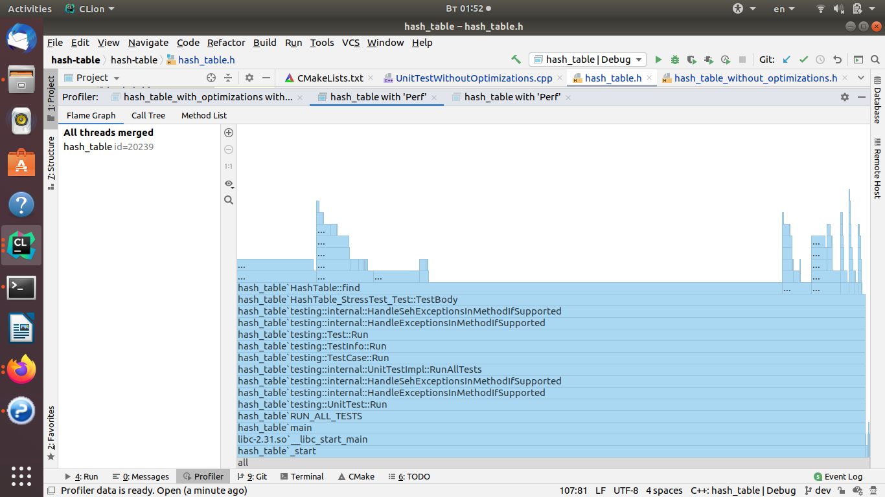
* Тестирование показало следующий результат:
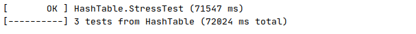
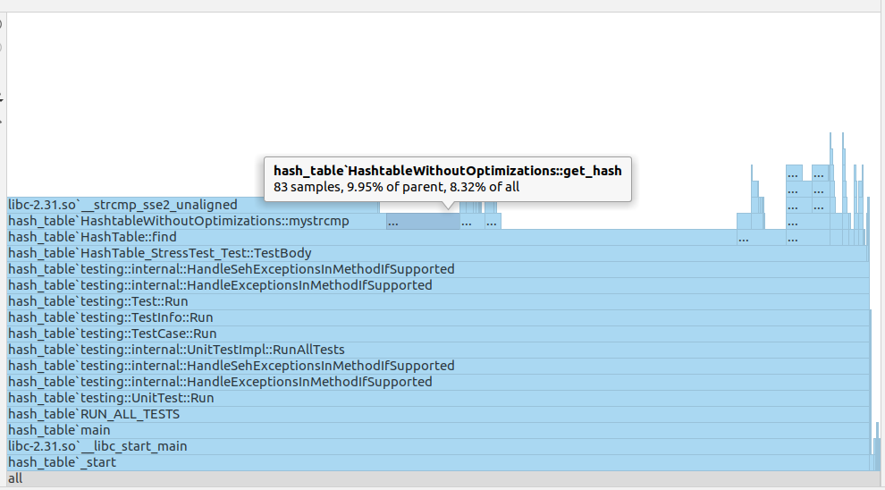
 Было решено ускорять с помощью ассемблерных вставок и векторных инструкций хеширующую функцию(CRC-32) и функцию сравнения строк.
 Функция сравнения строк - библиотечная.
* Код хеширующей функции:
 ```c++
 size_t get_hash (MyString* hashed) {
         const char* str = hashed->my_string;
         uint crc = 0xFFFFFFFF;
         for (int i = hashed->size; i > 0; --i) {
             crc = (crc >> 8) ^ Crc32Table[(crc ^ *str) & 0xFF];
             ++str;
         }
         return (crc ^ 0xFFFFFFFF) & (table_size - 1);
     }
```
* ASM-версия хеширующей функции:
```asm
GetHash:
    movq 8(%rdi), %rcx
    shr $2, %rcx

    mov (%rdi), %rdx

    xor	%rax, %rax

    hash_loop:
         crc32q (%rdx, %rcx, 4), %rax
         loop hash_loop

    crc32q (%rdx), %rax

    and $524287, %rax
retq
```
* ASM-версия сравнения:
```asm
CmpStr:
    mov %rdi, %rax
    mov %rsi, %rdx

    sub %rax, %rdx
    sub $16, %rax
    cmp_loop:
        add $16, %rax
        movdqu	(%rax), %xmm0
        pcmpistri $24, (%rax, %rdx), %xmm0

        ja cmp_loop

    jc exit
    xor	%rax, %rax
    exit:
ret
```
* Были получены следующие результаты:
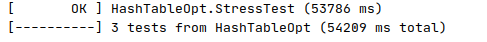
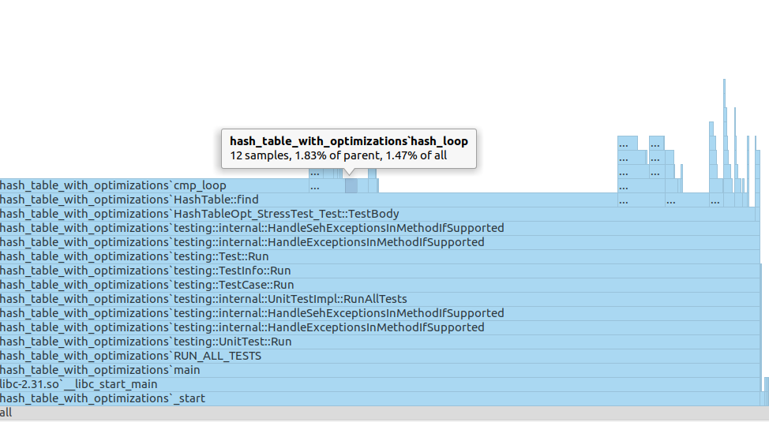.
 То есть, было достигнуто ускорение в ~1.33 раза.
* При опциях компиляции O1, O2 и O3 были получены следующие результаты для неоптимизированного и оптимизированного вариантов соответственно:
######O1:
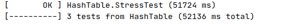
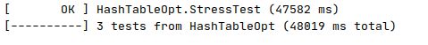.

######O2:
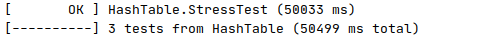
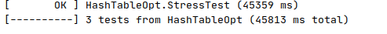.

######O3:
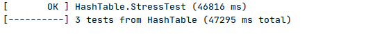
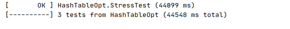.
* Как мы видим, расхождение сокращается.